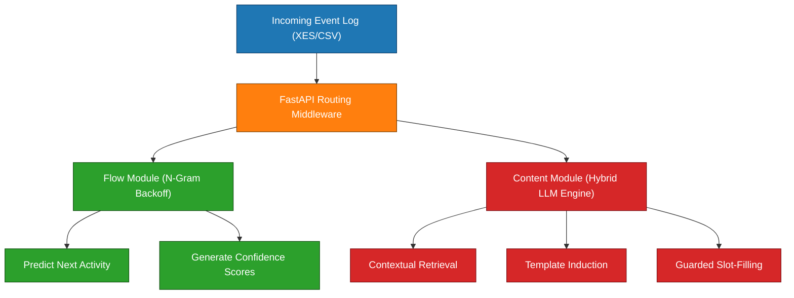

# Process-Aware Text Recommendation System

A production-ready **process-aware text recommendation engine** built to combat cognitive friction and document heavy bureaucracy in corporate workflows. By establishing a bridge between **Predictive Process Monitoring (PPM)** and **Textual Case-Based Reasoning (CBR)**, the system bypasses unconstrained, risky generative text. Instead, it observes historical event logs to predict upcoming workflow activities and structurally prescribes fully contextualized, guarded, slot-filled text templates.



## Key Features

- **Dual-Engine Architecture:** Separates execution trace modeling from semantic text synthesis to maintain high precision.
- **$N$-gram Backoff Flow Engine:** Models process control-flows using frequency-backed $N$-gram sequences capable of abstracting concurrent parallel execution paths.
- **Contextual Structural Retrieval:** Uses dense embeddings (`all-minilm:l6-v2`) and Cosine Similarity to isolate relevant historical textual traces.
- **Hybrid Scale LLM Engine:** Optimizes operational cost by chaining a high-capacity Cloud LLM (`Gemini 3`) for zero-shot _Template Induction_ during training with an agile, local LLM (`Llama 3 8B`) for runtime _Intelligent Slot-Filling_.
- **Deterministic & Semantic Guardrails:** Employs explicit text-anchoring heuristics alongside threshold filters to prevent hallucinations and enforce strict compliance.
- **Binary Model Versioning:** Native backup and rollback endpoints to safeguard historical state and support continuous training iterations.

## Architecture Overview

The system operates across two isolated execution cycles:

### 1. Model Training Workflow (_Design-Time_)

Administered endpoints ingest raw historical sequences (`train.csv` / XES logs). The **Flow Module** builds concurrent trace maps using localized prefix vistas, while the **Content Module** reads raw textual inputs, measures contextual density, and coordinates with the Cloud LLM to extract stable semantic phrases, producing dynamic parameter maps (_Slots_).

### 2. Predictive & Prescriptive Inference (_Run-Time_)

Active case worker queries step through a decoupled three-stage pipeline:

1. **Activity Prediction:** Compares current prefix traces against the $N$-gram backoff dictionary.
2. **Contextual Content Selection:** Performs a Cosine Similarity match over active event texts to surface the most probable template family.
3. **Intelligent Completion:** Automatically isolates and extracts variable states using token anchors and rule-based heuristics. If the confidence metric falls below a configurable threshold, the task falls back to the local LLM to execute bounded grounding.

## Technical Prerequisites

### Hardware Context

- **GPU Target:** Validated on consumer-tier GPUs with VRAM $\ge$ 10GB (e.g., NVIDIA RTX 3060, AMD RX 6700).
- **Inference Constraints:** Engineered to run quantized local parameters up to 10B variables efficiently at run-time.

### Software Dependencies

- **Ollama Engine:** Serves localized model dependencies. Ensure the daemon is running with these active pulls:
    - `llama3.1:8b` (Local completion agent)
    - `all-minilm:l6-v2` (Vector embedding model)
- **Python UV:** High-performance package manager used to pin the execution virtual environment.
- **GNU Make:** Builds automation routines.
- **Gemini API Key:** Required for structural template induction during training. Ensure your tier covers concurrent batched requests (e.g., processing a log with 30 unique tasks triggers 30 synchronous extraction pipelines).

## Installation & Setup

1. **Clone the Repository**

    ```bash
    git clone https://github.com/DanielArmindo/predictive-prescriptive-process-mining.git
    cd predictive-prescriptive-process-mining
    ```
    
2. **Configure Environment Variables**
    
    Copy `env-example` to `.env` and fill in your respective API keys and endpoint flags:
    
    ```bash
    cp env-example .env
    ```
    
3. **Install Environment Dependencies**

    ```bash
    uv sync
    ```
    
4. **Launch the Core API Engine**

    ```bash
    make dev
    # In a separate terminal window to map endpoints
    make endpoints
    ```
    

## System Usage & Quickstart

### Step 1: Fitting Models over an Event Log

To instantiate predictions for a specific business domain (e.g., procurement domain `dataset_1`), navigate to the `/admin/new_dataset` endpoint.

Provide the required inputs:

- **body**: Inject your training parameters using the format matching `dataset/metadata.json`.    
- **content_dataset**: Upload your event log sequence (`dataset/train.csv`).
- **manual_templates**: Upload an explicit tabular sheet (`dataset/templates.csv`) to enforce static, human-mapped templates instead of triggering automated LLM induction.

Click **Execute**. After that, the server generates the architectures in memory. To persist them as backup artifacts (Optional), use the `POST /backups` or `POST /backups/{id}` endpoints.

### Step 2: Running Next-Activity Prediction

To evaluate the control-flow trace and predict upcoming sequence actions, dispatch a payload to the `/predict/` endpoint:

- **Request Body (`POST /predict/`)**

    ```json
    {
      "model": "dataset_1",
      "inProcess": false,
      "prefix": [
        "Register request",
        "Validate request",
        "Check budget",
        "Authorize expense",
        "Commit expense"
      ]
    }
    ```
    
    > _Note: If your execution context resides inside a parallel sub-process, identify the step layout via your trace schema data and set `"inProcess": true`._
    
- **Expected Response**

    ```json
    [{ "activity": "Issue order", "prob": 1.0 }]
    ```

### Step 3: Running Prescriptive Document Completion

Once the target activity is identified, pass the full logical sequence alongside the accumulated semantic case history to the `/predict/content` endpoint to compile the document body:

- **Request Body (`POST /predict/content`)**

    ```json
    {
      "model": "dataset_1",
      "activity": [
        "Register request", "Validate request", "Check budget", 
        "Authorize expense", "Commit expense", "Issue order"
      ],
      "prefix_content": [
        "Request PROC.2026.00000795 was registered by Diogo Almeida for project Student Portal, with an estimated amount of 7.541,75€. The case was opened with the available administrative information, assigned to the competent service, and prepared for subsequent validation of documents, budget information, and process eligibility.",
        "The request PROC.2026.00000795 was validated on the basis of the submitted administrative elements. The information available in the case is sufficient to continue the workflow, allowing the process to proceed to budget checking without requiring additional clarification from the requester at this stage.",
        "Budget availability was confirmed for process PROC.2026.00000795, in the amount of 7.541,75€, under budget record BUD.2026.00000753. The financial information was checked against the registered request, and no budgetary obstacle was identified for continuing the authorization and commitment stages.",
        "I authorize the expense for process PROC.2026.00000795, in the amount of 7.541,75€, under the applicable reference DL 18/2008. The authorization is issued after validation of the administrative and budgetary elements, enabling the process to continue to the commitment stage.",
        "Commitment COM.2026.00000714 was generated for process PROC.2026.00000795, in the amount of 7.541,75€. The commitment records the authorized expenditure in the financial system and confirms that the process has the necessary budgetary support to proceed to the order or contract stage."
      ]
    }
    ```
    
- **Expected Prescribed Text Output**

    ```txt
    Order <order_id> was issued for process PROC.2026.00000795. The order document reflects the validated request, the authorized expenditure, and the recorded financial commitment, and it is now available to support communication with the requester and the completion of the procurement procedure.
    ```

To test custom iterations, sample batches of sequence variations can be extracted directly from `dataset/test.csv`.

## Data Validation Contract

The internal processing pipes require raw logs mapping to the following schema structural properties:

| **Event Attribute** | **Target Structural Type** | **Description**                                                                                                         |
| ------------------- | -------------------------- | ----------------------------------------------------------------------------------------------------------------------- |
| `Case ID`           | String / Numeric Key       | Unique identifier hashing the process execution instance.                                                               |
| `Activity`          | String Token               | Explicit label designating the specific task execution.                                                                 |
| `Timestamp`         | ISO 8601 DateTime          | Execution termination log marker.                                                                                       |
| `Start Timestamp`   | ISO 8601 DateTime          | Task allocation/instantiation marker.                                                                                   |
| `Textual Content`   | Unstructured String        | Notes, explanations, or structural text payloads generated during the task.                                             |
| `nr_step`           | Integer / Dotted String    | Order schema locator indicating execution position (e.g., detects dot suffix `.X` to isolate nested parallel branches). |

## Repository Structure

```txt
project/
├── api/                    # FastAPI Application Interface Layer
│   ├── endpoints/          # Route controller orchestration
│   ├── schemas/            # Pydantic data contract validations
│   ├── RWLock.py           # Concurrency read-write engine lock
│   └── startup.py          # Early memory state initialization
│
├── backups/                # Local serialized model cache binaries (.pkl)
│
├── core/                   # Machine Learning Pipeline Framework
│   ├── llm/                # Prompt managers and multi-model dispatch adapters
│   ├── models/             # Isolated Flow Engine and Content Model classes
│   ├── backups.py          # Automated state serialization handlers
│   ├── builder.py          # End-to-end model compiler orchestrator
│   └── constants.py        # Shared internal system Dataclasses
│
├── dataset/                # Pre-packaged evaluation event logs
│   ├── train.csv           # Ingestion dataset for baseline training
│   ├── test.csv            # Validation pool tracking system performance
│   ├── templates.csv       # Human-validated template seeds
│   └── metadata.json       # Structural metadata binding log types
│
├── main.py                 # Application bootstrapper root
├── env-example             # Environment template mapping configurations
├── Makefile                # Shorthand system terminal macros
├── pyproject.toml          # Pinned uv environment definitions
└── uv.lock                 # Strict reproducible dependency lockfile
```

## Operational Safety & Human-in-the-Loop

This framework operates strictly as a **prescriptive recommendation utility**, not an autonomous agent.

- **Sovereignty of Action:** System boundaries enforce that text recommendations must pass user validation before committing downstream to production databases.
- **Predictive Boundary Isolation:** The underlying pipelines are intentionally designed to suppress output when encountering historical anomalies or state configurations that fall completely outside the training dataset boundaries. The engine prioritizes a blank response over ungrounded generation.
